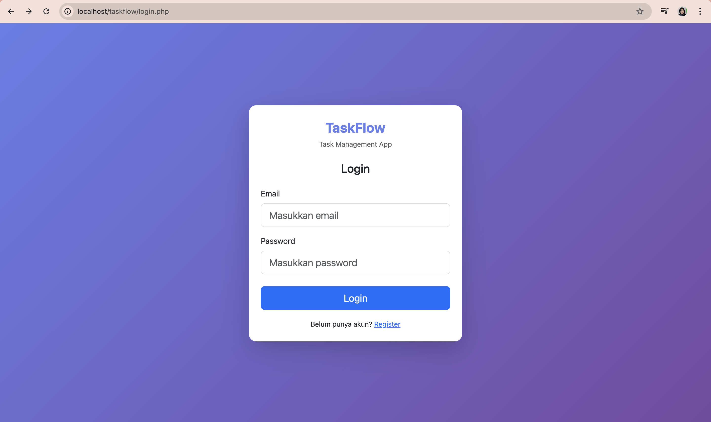
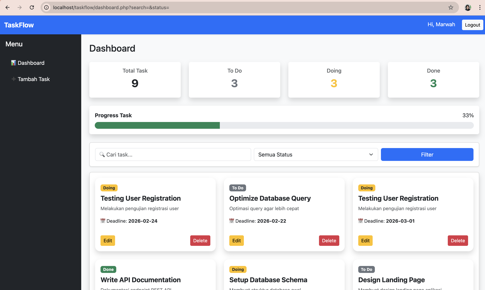
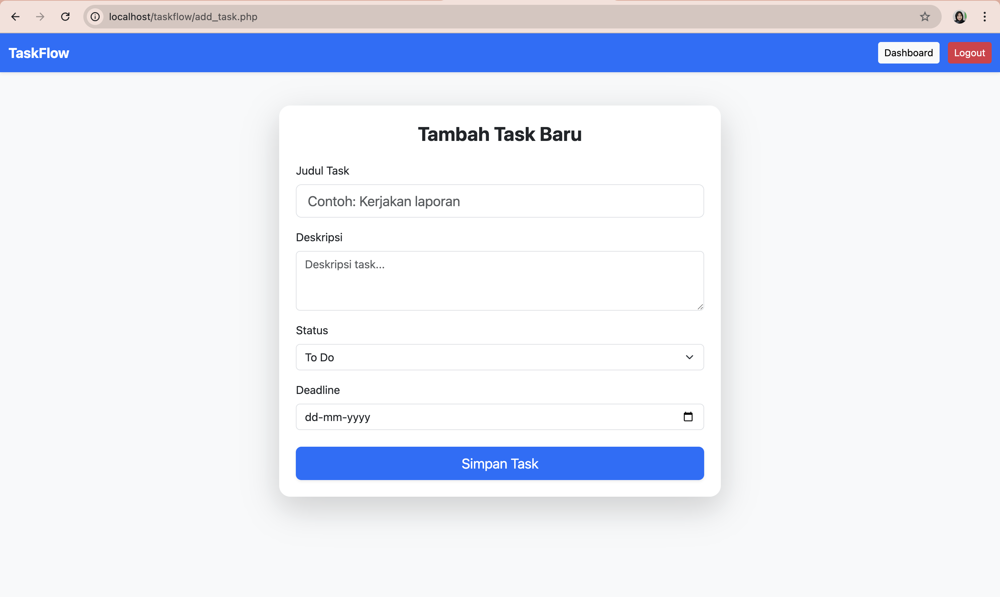

# TaskFlow - Task Management Web App

TaskFlow adalah aplikasi manajemen tugas berbasis web yang memungkinkan user untuk membuat, mengedit, dan menghapus task dengan sistem autentikasi login & registrasi.

Project ini dibuat untuk melatih implementasi CRUD, autentikasi, dan dashboard statistik menggunakan PHP dan MySQL.

---

## 🚀 Features

- User Registration & Login
- Secure Authentication
- Add Task
- Edit Task
- Delete Task
- Dashboard with Task Statistics
- Modern Card View UI
- Responsive Design (Bootstrap)

---

## 🛠 Tech Stack

- PHP (Native)
- MySQL
- Bootstrap 5
- HTML & CSS

---

## 📸 Preview

### 🔐 Login Page

### 📊 Dashboard

### ✏️ Add / Edit Task

---

## 🗂 Database Structure

Example table structure:

**users**
- id
- name
- email
- password

**tasks**
- id
- user_id
- title
- description
- status
- created_at

---

## 📌 Future Improvements
- Task filtering by status
- Pagination
- User profile page
- Search feature
## ⚙️ Installation

1. Clone repository
2. Import database ke phpMyAdmin
3. Sesuaikan file `config.php` dengan konfigurasi database
4. Jalankan di localhost (XAMPP / Laragon)

---

## 🎯 Purpose of This Project

Project ini dibuat sebagai bagian dari portfolio untuk menunjukkan kemampuan dalam:
- Backend Development (PHP)
- Database Management
- Authentication System
- CRUD Implementation
- Basic UI/UX structuring

---

## 👩‍💻 Author

Marwah Hilalliyah
